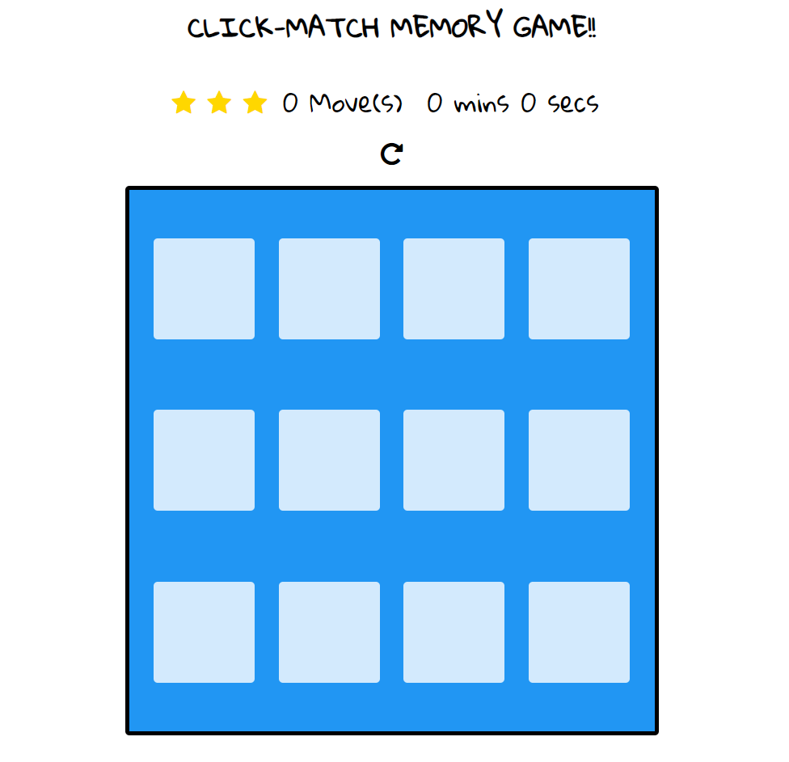

# Author name

Anita Mutemi

## Project name

Tile Matching Game Board

## Description

A tile matching game is a popular genre of puzzle game where the objective is to match tiles of the same type or pattern to clear them from the game board in order to win the game. There will be a card of 12 tiles in which two tiles are identical, the player needs to match each pair to win the game.

## Installation

To set up the Rocarstor car website, follow these steps:

1. Format the HTML file by including relevant elements cloned to css and html.
2. Format the CSS file for the website's design.
3. Write a Java Script folder.
3. Use an external Git repository and provide the SSH path.
4. Make at least 20 commits in Git, with each change.
5. Push your commands and run the HTML, CSS and Java files in a valid browser to view your website.

## Design

 

The design for the portfolio website can be found in the attached image.

## Technologies Used

The portfolio car website is built using custom HTML and CSS. The following languages and tools were used:

- HTML5
- CSS3
- VS Code
- Git
- JavaScript

## Contact

In case of any issues or questions regarding Tile Matching Game Board, you can reach out to the Moringa School website for support.

## License

Built by Anita. &copy; 2023 Markup Devops
